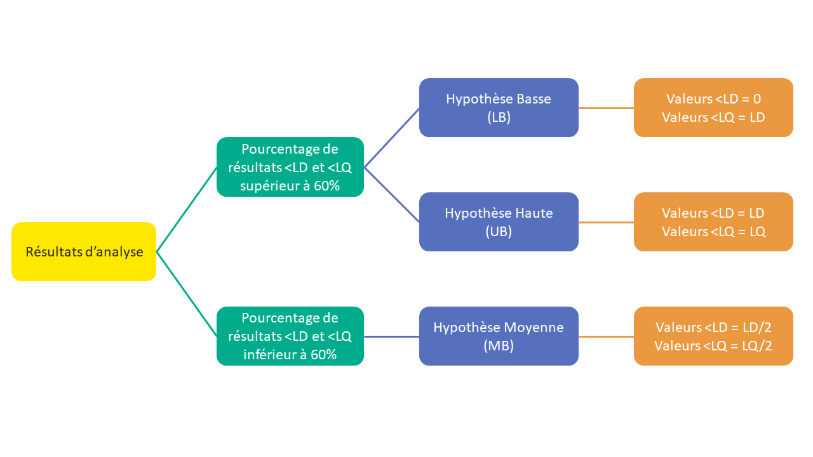

```{=html}
<style> div.main-container { max-width: 1400px; } </style>
```
# Accueil

```{r webappheader, echo = F, out.width = '100%'}
knitr::include_graphics("www/fig/caliviz_dashboardheader.png")
app_lang <<- "FR"
```

<p align="right" style="color:#FF9940">*Dernière mise à jour: le 10 octobre 2023*</p>

<p align="right"> {width=20px} FR   -   {width=20px} [EN](https://caliviz.shinyapps.io/App_EN) </p>

<h1> Un outil interactif permettant la visualisation des substances chimiques auxquelles est exposée la population française via son alimentation </h1>

<h3>Contexte et enjeu</h3>

Selon les résultats de la dernière édition de l'étude de l'alimentation totale (EAT), le risque sanitaire ne peut être exclu dans certains groupes de la population pour 12 substances présentes dans notre alimentation courante. Aujourd'hui, la surveillance alimentaire est réalisée aléatoirement. Une optimisation de la surveillance via l'identification et le ciblage des couples aliments/substances qui posent problème est donc d'utilité publique, visant in fine à protéger le consommateur.

*Comment optimiser la sécurité sanitaire des aliments et la surveillance des couples aliments/substances qui posent véritablement problème ?*

<h3>Les études EAT</h3>

L'Anses a pour mission de contribuer à assurer la sécurité sanitaire dans les domaines de l'alimentation, de l'environnement et du travail. Dans ce cadre, elle a lancé en 2006 sa deuxième étude de l'alimentation totale (EAT 2), ayant pour objectifs d'une part de décrire les expositions alimentaires de la population française à des substances d'intérêt en termes de santé publique, d'autre part de caractériser les risques sanitaires liés à l'alimentation et associés à ces substances [...]
<a href="https://www.anses.fr/fr/content/%C3%A9tude-de-l%E2%80%99alimentation-totale-eat-2-l%E2%80%99anses-met-%C3%A0-disposition-les-donn%C3%A9es-de-son-analyse" target="_blank">Lire la suite de l'article</a>

# Présentation des substances

*Cet onglet permet aux utilisateurs d'obtenir, de manière interactive avec le menu déroulant ci-dessous, les informations relatives aux substances ou familles de substances analysées dans l'étude EAT2 et synthétisées à partir des rapports scientifiques de l'étude.*

```{r packages, echo=FALSE, message=FALSE, warning=FALSE}
source("R/packages.R")

```

```{r subs_pres, echo=FALSE}
d_subs_pres <- read_excel(path = "data/raw/Caliviz_PresentationSubstances.xlsx", sheet = "FR")

inputPanel(
  selectInput("eat2_fam_sub_pres", label = "Substance",
              choices = tapply(d_subs_pres$`Substance_nom`, d_subs_pres$`Famille`, function(x) x))
              # choices = unique(d_subs_pres$`Substance_nom`))
)

```

```{=html}
<style>
  .nav-pills>li>a:hover, .nav-pills>li>a:focus, .nav-pills>li.active>a,     .nav-pills>li.active>a:hover, .nav-pills>li.active>a:focus{background-color: #5770BE;}
</style>
```
##  {.tabset .tabset-pills data-height="2000,"}

### Résumé

```{r echo=FALSE}
renderUI({ HTML(d_subs_pres$Abstract[d_subs_pres$Substance_nom == input$eat2_fam_sub_pres]) })
```

### Informations détaillées

##### 

```{r echo=FALSE}
renderUI({ HTML(d_subs_pres$GeneralInfo[d_subs_pres$Substance_nom == input$eat2_fam_sub_pres]) })
```

##### Caractérisation du danger

```{r echo=FALSE}
renderUI({ HTML(d_subs_pres$Hazards[d_subs_pres$Substance_nom == input$eat2_fam_sub_pres]) })
```

##### Evaluation et caractérisation du risque

```{r echo=FALSE}
renderUI({ HTML(d_subs_pres$Risks[d_subs_pres$Substance_nom == input$eat2_fam_sub_pres]) })
```

##### Synthèse des conclusions de l'étude EAT2

###### Risques toxicologiques

```{r echo=FALSE}
renderUI({ HTML(d_subs_pres$ToxicoRisk_EAT2[d_subs_pres$Substance_nom == input$eat2_fam_sub_pres]) })
```

###### Risques nutritionnels

```{r echo=FALSE}
renderUI({ HTML(d_subs_pres$NutriRisk_EAT2[d_subs_pres$Substance_nom == input$eat2_fam_sub_pres]) })
```

###### Actions et besoin de recherche

```{r echo=FALSE}
renderUI({ HTML(d_subs_pres$Actions_EAT2[d_subs_pres$Substance_nom == input$eat2_fam_sub_pres]) })
```


### Tableaux

La visualisation interactive des tableaux est en cours de construction. Tous les tableaux peuvent être consultés dans les rapports de l'étude EAT2:

- <a href="https://www.anses.fr/fr/system/files/PASER2006sa0361Ra1.pdf">Tome 1: Contaminants inorganiques, minéraux, polluants organiques persistants, mycotoxines, phyto-estrogènes</a>

- <a href="https://www.anses.fr/fr/system/files/PASER2006sa0361Ra2.pdf">Tome 2: Résidus de pesticides, additifs, acrylamide,
hydrocarbures aromatiques polycycliques</a>


# Données de contamination

##  {.tabset .tabset-pills data-height="1300,"}

### Limites analytiques

#### 

La quantification d'une substance chimique dans un aliment peut parfois rencontrer des difficultés en raison des limites analytiques. Il s'agit notamment des limites de détection de la substance (LD) dans l'aliment par l'appareil de mesure et/ou de quantification (LQ).

Une substance est dite « détectée » dès lors que l'analyse a mis en évidence sa présence dans un aliment. Dans le cas contraire, la substance sera inférieure à la limite de détection (\<LD).

Une substance est dite « quantifiée » lorsqu'elle a été détectée et que sa teneur est suffisamment importante pour être quantifiée. Si la teneur est très basse et que l'appareil analytique n'est pas en mesure de la quantifier, elle est seulement dite « détectée » mais inférieure à la limite de quantification (\<LQ).

Pour pouvoir exploiter ces données non chiffrées, différentes hypothèses peuvent être utilisées pour avoir une estimation du niveau de contamination de ces substances en tenant compte de ces limites analytiques. Deux cas de figure ont été retenus conformément aux lignes directrices (GEMS-Food Euro, 1995) :

1.  le pourcentage de résultats \<LD et \<LQ est inférieur à 60%, les données sont remplacées par une hypothèse moyenne dite « middle bound (MB) » :

Toutes les valeurs non détectées (\<LD) sont fixées à ½ LD. Toutes les valeurs non quantifiées (\<LQ) sont fixées à ½ LQ.

2.  le pourcentage de résultats \<LD et \<LQ est supérieur à 60%, les données sont remplacées par deux hypothèses :

Hypothèse basse dite « lower bound (LB) » où toutes les valeurs non détectées (\<LD) sont fixées à zéro et toutes les valeurs non quantifiées (\<LQ) sont fixées à la LD ou à 0 si la LD n'est pas renseignée. Hypothèse haute dite « upper bound (UB) » où toutes les valeurs non détectées (\<LD) sont fixées à la LD et toutes les valeurs non quantifiées (\<LQ) sont fixées à la LQ.

#### 

```{r, echo = F, out.width = '70%', fig.align = 'center'}

```

### Présence significative

#### 

Cet onglet permet de déterminer, en se basant sur les données des études EAT2 et EATi, s'il y a une présence significative d'une ou plusieurs substances dans un ou plusieurs aliments sélectionés. La présence significative d'une substance dans un aliment se définit ici *a minima* par une détection ou une quantification (*présence significative: NQ ou valeur chiffrée*).

*Pour visualiser: sélectionner un ou plusieurs aliments dans la liste (sélectionner avec le menu déroulant ou entrer les noms des aliments); puis sélectionner une ou plusieurs substances analysées; cliquer sur "Visualiser".*

#### 

```{r ShinyApp_PS, echo=FALSE, message=FALSE, warning=FALSE}
## User interface ####
source("R/_ui_PS.R")

## Server ####
source("R/_server_PS.R")

shinyApp(
  ui = ui_PS,
  server = server_PS,
  options = list(height = 1080, width = 1200)
)
```


### Identification des dangers

Cet onglet permet de déterminer, en se basant sur les données des études EAT2, la liste des substances qui sont significativement présentes dans un aliment sélectionné. La présence significative d'une substance dans un aliment se définit ici *a minima* par une détection ou une quantification (*présence significative: NQ ou valeur chiffrée*).

*Pour visualiser: sélectionner un aliment dans la liste (sélectionner avec le menu déroulant ou entrer les noms des aliments); cliquer sur "Liste des dangers".*

```{r ShinyApp_HI, echo=FALSE, message=FALSE, warning=FALSE}
## User interface ####
source("R/_ui_HI.R")

## Server ####
source("R/_server_HI.R")

shinyApp(
  ui = ui_HI,
  server = server_HI,
  options = list(height = 1080, width = 1200)
)
```


### Niveaux de contamination

```{r ShinyApp_conta, echo=FALSE, message=FALSE, warning=FALSE}
## User interface ####
source("R/_ui_conta.R")

## Server ####
source("R/_server_conta.R")

shinyApp(
  ui = ui_conta,
  server = server_conta,
  options = list(height = 1000, width = 1200)
)
```

### Cartographie

```{r ShinyApp_carto, echo=FALSE, message=FALSE, warning=FALSE}
## User interface ####
source("R/_ui_carto.R")

## Server ####
source("R/_server_carto.R")

shinyApp(
  ui = ui_carto,
  server = server_carto,
  options = list(height = 1080, width = 1200)
)
```

# Aliments contributeurs

##### Exposition alimentaire de la population aux substances chimiques

L'exposition est la quantité d'une substance ingérée par le consommateur. Elle se calcule pour une personne via son alimentation en prenant en compte à la fois le niveau de contamination de tous les différents aliments / groupe d'aliments par cette substance, sa consommation individuelle de ces aliments ainsi que son poids corporel.

L'exposition est calculée pour tous les individus et une exposition moyenne de la population est ainsi calculée. Elle représente la quantité moyenne d'une substance ingérée par la population via son régime alimentaire total.

Si l'on souhaite connaître la part apportée par chaque groupe d'aliments dans cette quantité de substance ingérée par la population, on parlera de contribution à l'exposition totale. Celle-ci, exprimée en pourcentage, représente la quantité de substance apportée par un groupe d'aliments par rapport à tout le régime alimentaire. La somme des contributions est égale à 100%.

*(en cours de construction, toutes les familles de substances ne sont pas encore intégrées)*

##### 

```{r ShinyApp_contri, echo=FALSE, message=FALSE, warning=FALSE}
## User interface ####
source("R/_ui_contri.R")

## Server ####
source("R/_server_contri.R")

shinyApp(
  ui = ui_contri,
  server = server_contri,
  options = list(height = 1200, width = 1300)
)
```

# Références

<h3>Données</h3>

Les données intégrées dans cet outil de visualisation sont issues de l'étude de l'alimentation totale (EAT2) menée par l'Anses et publiée en 2014. Ces données sont accessibles sur data.gouv:

- <a href="https://www.data.gouv.fr/fr/datasets/donnees-regionales-eat2-etude-de-l-alimentation-totale/" target="_blank">Données issues de l'étude EAT2 (Anses, 2014)</a>

- <a href="https://www.data.gouv.fr/fr/datasets/bisphenol-a/" target="_blank">Données relatives aux niveaux de concentration en BPA des différents aliments issus de l'étude EAT2 (Anses, 2013)</a>

- <a href="https://www.data.gouv.fr/fr/datasets/donnees-etude-de-lalimentation-totale-infantile/" target="_blank">Données issues de l'étude de l'Alimentation Totale infantile EATi (Anses, 2018)</a>


<h3>Pré-traitement des données</h3>

La première étape du projet Caliviz a consisté à traiter les données inférieures aux limites de détection ou de quantification, dites données censurées, pour tenir compte des limites analytiques et des spécificités des différentes familles de substances. En fonction des substances et des groupes d'aliments pour lesquels les limites analytiques sont connues ou non, les données censurées étaient renseignées dans les fichiers sous différents formats. Par conséquent, plusieurs prétraitements spécifiques pour les différentes familles de substances ont été ainsi réalisés afin d'harmoniser l'ensemble des données qui seront ensuite intégrées à l'outil de visualisation.

**Formatage de type 1**: Contaminants inorganiques et minéraux - Acrylamide. Dans ce cas, les données censurées sont uniquement sous la forme "ND/NQ" et les limites analytiques sont connues. La contamination de chaque aliment par chaque substance est estimée en fonction des hypothèses de censure comme suit:

-   Hypothèse moyenne (MB) : ND = LOD/2 et NQ = LOQ/2
-   Hypothèse basse (LB) : ND = 0 et NQ = LOD
-   Hypothèse haute (UB) : ND = LOD et NQ = LOQ

**Formatage de type 2**: HAP - Dioxynes, PC8 - Perfluorés - Bromés. Dans ce cas, les données censurées sont renseignées la forme "\<valeur" et que les limites de détection et/ou de quantification ne sont pas connues. La contamination de chaque aliment par chaque substance est estimée en fonction des hypothèses de censure comme suit:

-   Hypothèse moyenne (MB) : \<valeur = valeur/2
-   Hypothèse basse (LB) : \<valeur = 0
-   Hypothèse haute (UB) : \<valeur = valeur

**Formatage de type 3**: Additifs - Pesticides. Dans ce cas les données censurées sont sous la forme ND(valeur)/NQ(valeur) et que les limites analytiques ne sont pas fournies. La contamination de chaque aliment par chaque substance est estimée en fonction des hypothèses de censure comme suit:

-   Hypothèse moyenne (MB) : ND(valeur) = valeur/2 et NQ(valeur) = valeur/2
-   Hypothèse basse (LB) : ND(valeur) = 0 et NQ(valeur) = 0
-   Hypothèse haute (UB) : ND(valeur) = valeur et NQ(valeur) = valeur

<h3>Ressources</h3>

- <a href="https://gitlab.com/data-challenge-gd4h/caliviz/" target="_blank">Gitlab</a> du premier protoype Caliviz (Streamlit) développé dans le cadre du défi Green Data for Health.

<h3>Une question ?</h3>
Contactez-nous: caliviz@anses.fr

<p style="color:#5770BE"> **Membres du groupe Caliviz**: </p> <p style="color:#5770BE"> Cindy Sotton, Louis Staquet, Caroline Beltran, Julie Neble, Emilie Thiard, Laurence Leon, Ngoc-Du Martin Luong et Nawel Bemrah </p> 