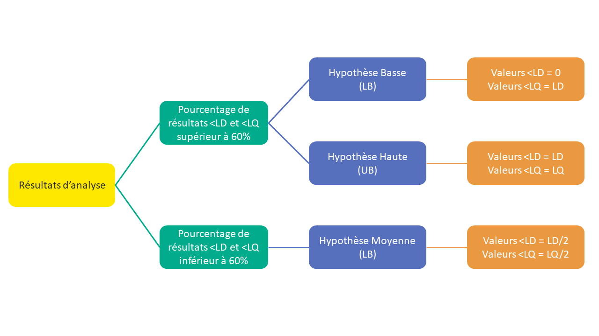

```{=html}
<style> div.main-container { max-width: 1400px; } </style>
```
# Home

<h1> <center> Caliviz - An interactive tool for visualizing the dietary exposure of the French population to chemicals </center> </h1>

```{r webappheader, echo = F, out.width = '100%'}

```

<p style="color:#5770BE"> **Members of the Caliviz project group**: </p> <p style="color:#5770BE"> Cindy Sotton, Louis Staquet, Caroline Beltran, Julie Neble, Emilie Thiard, Laurence Leon, Ngoc-Du Martin Luong et Nawel Bemrah </p> 

<p style="color:#FF9940">*Last update: September 19th 2023 *</p>


<h3>Context </h3>

According to the results of the latest edition of the Total Diet Study (TDS), health risk cannot be excluded in certain groups of the population for 12 substances present in our common diet. Today, food surveillance is carried out randomly. Optimizing surveillance through the identification and targeting of problematic food/substance pairs is therefore in the public interest, ultimately aiming to protect the consumer.

*How can we optimize food safety and the monitoring of food/substance pairs that really pose a problem ?*

<h3>Total Diet Studies</h3>

ANSES's mission is to help ensure health safety in the areas of food, the environment and work. In this context, in 2006 it launched its second total diet study (EAT 2), with the objectives of describing the dietary exposure of the French population to substances of interest in terms of public health, on the other hand, to characterize the health risks linked to food and associated with these substances [...]
<a href="https://www.anses.fr/fr/content/%C3%A9tude-de-l%E2%80%99alimentation-totale-eat-2-l%E2%80%99anses-met-%C3%A0-disposition-les-donn%C3%A9es-de-son-analyse" target="_blank">See more... </a>

<!-- # Substances -->

<!-- *This tab allows users to obtain, interactively with the drop-down menu below, information relating to the substances or families of substances analyzed in the EAT2 study and synthesized from the study's scientific reports.* -->

<!-- ```{r packages, echo=FALSE, message=FALSE, warning=FALSE} -->
<!-- source("R/packages.R") -->

<!-- ``` -->

<!-- ```{r subs_pres, echo=FALSE} -->
<!-- d_subs_pres <- read_excel(path = "data/raw/Caliviz_PresentationSubstances.xlsx", sheet = "FR") -->

<!-- inputPanel( -->
<!--   selectInput("eat2_fam_sub_pres", label = "Substance", -->
<!--               choices = tapply(d_subs_pres$`Substance_nom`, d_subs_pres$`Famille`, function(x) x)) -->
<!-- ) -->

<!-- ``` -->

<!-- ```{=html} -->
<!-- <style> -->
<!--   .nav-pills>li>a:hover, .nav-pills>li>a:focus, .nav-pills>li.active>a,     .nav-pills>li.active>a:hover, .nav-pills>li.active>a:focus{background-color: #5770BE;} -->
<!-- </style> -->
<!-- ``` -->
<!-- ##  {.tabset .tabset-pills data-height="1200,"} -->

<!-- ### Summary -->

<!-- ```{r echo=FALSE} -->
<!-- renderUI({ HTML(d_subs_pres$Abstract[d_subs_pres$Substance_nom == input$eat2_fam_sub_pres]) }) -->
<!-- ``` -->

<!-- ### Details -->

<!-- #####  -->

<!-- ```{r echo=FALSE} -->
<!-- renderUI({ HTML(d_subs_pres$GeneralInfo[d_subs_pres$Substance_nom == input$eat2_fam_sub_pres]) }) -->
<!-- ``` -->

<!-- ##### Hazard characterization -->

<!-- ```{r echo=FALSE} -->
<!-- renderUI({ HTML(d_subs_pres$Hazards[d_subs_pres$Substance_nom == input$eat2_fam_sub_pres]) }) -->
<!-- ``` -->

<!-- ##### Risk assessment and characterization -->

<!-- ```{r echo=FALSE} -->
<!-- renderUI({ HTML(d_subs_pres$Risks[d_subs_pres$Substance_nom == input$eat2_fam_sub_pres]) }) -->
<!-- ``` -->

<!-- ##### Summarized conclusions of the TDS -->

<!-- ###### Toxicological risks -->

<!-- ```{r echo=FALSE} -->
<!-- renderUI({ HTML(d_subs_pres$ToxicoRisk_EAT2[d_subs_pres$Substance_nom == input$eat2_fam_sub_pres]) }) -->
<!-- ``` -->

<!-- ###### Nutritional risks -->

<!-- ```{r echo=FALSE} -->
<!-- renderUI({ HTML(d_subs_pres$NutriRisk_EAT2[d_subs_pres$Substance_nom == input$eat2_fam_sub_pres]) }) -->
<!-- ``` -->

<!-- ###### Actions and research perspectives -->

<!-- ```{r echo=FALSE} -->
<!-- renderUI({ HTML(d_subs_pres$Actions_EAT2[d_subs_pres$Substance_nom == input$eat2_fam_sub_pres]) }) -->
<!-- ``` -->

# Contamination data

##  {.tabset .tabset-pills data-height="1300,"}

### Analytical limitations

#### 

The quantification of a chemical substance in a food can sometimes encounter difficulties due to analytical limitations. These include the detection limits of the substance (LD) in the food by the measuring and/or quantification device (LQ).

A substance is said to be “detected” when the analysis has revealed its presence in a food. Otherwise, the substance will be below the detection limit (\<LD).

A substance is said to be “quantified” when it has been detected and its content is significant enough to be quantified. If the content is very low and the analytical device is not able to quantify it, it is only said to be “detected” but below the limit of quantification (\<LQ).

To be able to use this unquantified data, different hypotheses can be used to obtain an estimate of the level of contamination of these substances taking into account these analytical limits. Two scenarios were retained in accordance with the guidelines (GEMS-Food Euro, 1995):

1. the percentage of results \<LD and \<LQ is less than 60%, the data is replaced by an average hypothesis called “middle bound (MB)”:

All undetected values (\<LD) are set to ½ LD. All unquantized values (\<LQ) are set to ½ LQ.

2. the percentage of results \<LD and \<LQ is greater than 60%, the data is replaced by two hypotheses:

Low hypothesis called “lower bound (LB)” where all undetected values (\<LD) are set to zero and all unquantified values (\<LQ) are set to the LD or to 0 if the LD is not not informed. High hypothesis called “upper bound (UB)” where all undetected values (\<LD) are fixed at the LD and all unquantified values (\<LQ) are fixed at the LQ.

#### 

<!-- ```{r, echo = F, out.width = '70%', fig.align = 'center'} -->
<!--  -->
<!-- ``` -->

### Significant presence

#### 

This tab allows you to determine, based on data from the EAT2 and EATi studies, if there is a significant presence of one or more substances in one or more selected foods. The significant presence of a substance in a food is defined here *at a minimum* by detection or quantification (*significant presence: NQ or numerical value*).

*To view: select one or more foods from the list (select with the drop-down menu or enter the names of the foods); then select one or more analyzed substances; click on “View”.*

#### 

```{r ShinyApp_PS, echo=FALSE, message=FALSE, warning=FALSE}
## User interface ####
source("R/_ui_PS_EN.R")

## Server ####
source("R/_server_PS.R")

shinyApp(
  ui = ui_PS,
  server = server_PS,
  options = list(height = 1080, width = 1200)
)
```

### Contamination level

```{r ShinyApp_conta, echo=FALSE, message=FALSE, warning=FALSE}
## User interface ####
source("R/_ui_conta_EN.R")

## Server ####
source("R/_server_conta.R")

shinyApp(
  ui = ui_conta,
  server = server_conta,
  options = list(height = 1000, width = 1200)
)
```

### Cartography

```{r ShinyApp_carto, echo=FALSE, message=FALSE, warning=FALSE}
## User interface ####
source("R/_ui_carto_EN.R")

## Server ####
source("R/_server_carto.R")

shinyApp(
  ui = ui_carto,
  server = server_carto,
  options = list(height = 1080, width = 1200)
)
```

# Relative contributions

##### Dietary exposure of the population to chemical substances

Exposure is the amount of a substance ingested by the consumer. It is calculated for a person via their diet by taking into account both the level of contamination of all the different foods/food groups by this substance, their individual consumption of these foods as well as their body weight.

Exposure is calculated for all individuals and an average exposure of the population is thus calculated. It represents the average quantity of a substance ingested by the population through their total diet.

If we wish to know the share contributed by each food group in this quantity of substance ingested by the population, we will speak of contribution to total exposure. This, expressed as a percentage, represents the quantity of substance provided by a food group in relation to the entire diet. The sum of the contributions is equal to 100%.


##### 

```{r ShinyApp_contri, echo=FALSE, message=FALSE, warning=FALSE}
## User interface ####
source("R/_ui_contri_EN.R")

## Server ####
source("R/_server_contri.R")

shinyApp(
  ui = ui_contri,
  server = server_contri,
  options = list(height = 1200, width = 1300)
)
```

# References

<h3>Datasets</h3>

The data integrated into this visualization tool come from the total diet study (EAT2) conducted by Anses and published in 2014. These data are accessible on data.gouv:

- <a href="https://www.data.gouv.fr/fr/datasets/donnees-regionales-eat2-etude-de-l-alimentation-totale/" target="_blank">Data from the EAT2 (TDS) study (Anses, 2014)</a>

- <a href="https://www.data.gouv.fr/fr/datasets/bisphenol-a/" target="_blank">Data relating to BPA concentration levels of different foods from the EAT2 study (Anses, 2013)</a>

- <a href="https://www.data.gouv.fr/fr/datasets/donnees-etude-de-lalimentation-totale-infantile/" target="_blank">Data from the EATi  study(Anses, 2018)</a>


<!-- <h3>Pré-traitement des données</h3> -->

<!-- La première étape du projet Caliviz a consisté à traiter les données inférieures aux limites de détection ou de quantification, dites données censurées, pour tenir compte des limites analytiques et des spécificités des différentes familles de substances. En fonction des substances et des groupes d'aliments pour lesquels les limites analytiques sont connues ou non, les données censurées étaient renseignées dans les fichiers sous différents formats. Par conséquent, plusieurs prétraitements spécifiques pour les différentes familles de substances ont été ainsi réalisés afin d'harmoniser l'ensemble des données qui seront ensuite intégrées à l'outil de visualisation. -->

<!-- **Formatage de type 1**: Contaminants inorganiques et minéraux - Acrylamide. Dans ce cas, les données censurées sont uniquement sous la forme "ND/NQ" et les limites analytiques sont connues. La contamination de chaque aliment par chaque substance est estimée en fonction des hypothèses de censure comme suit: -->

<!-- -   Hypothèse moyenne (MB) : ND = LOD/2 et NQ = LOQ/2 -->
<!-- -   Hypothèse basse (LB) : ND = 0 et NQ = LOD -->
<!-- -   Hypothèse haute (UB) : ND = LOD et NQ = LOQ -->

<!-- **Formatage de type 2**: HAP - Dioxynes, PC8 - Perfluorés - Bromés. Dans ce cas, les données censurées sont renseignées la forme "\<valeur" et que les limites de détection et/ou de quantification ne sont pas connues. La contamination de chaque aliment par chaque substance est estimée en fonction des hypothèses de censure comme suit: -->

<!-- -   Hypothèse moyenne (MB) : \<valeur = valeur/2 -->
<!-- -   Hypothèse basse (LB) : \<valeur = 0 -->
<!-- -   Hypothèse haute (UB) : \<valeur = valeur -->

<!-- **Formatage de type 3**: Additifs - Pesticides. Dans ce cas les données censurées sont sous la forme ND(valeur)/NQ(valeur) et que les limites analytiques ne sont pas fournies. La contamination de chaque aliment par chaque substance est estimée en fonction des hypothèses de censure comme suit: -->

<!-- -   Hypothèse moyenne (MB) : ND(valeur) = valeur/2 et NQ(valeur) = valeur/2 -->
<!-- -   Hypothèse basse (LB) : ND(valeur) = 0 et NQ(valeur) = 0 -->
<!-- -   Hypothèse haute (UB) : ND(valeur) = valeur et NQ(valeur) = valeur -->

<!-- <h3>Ressources</h3> -->

<!-- - <a href="https://gitlab.com/data-challenge-gd4h/caliviz/" target="_blank">Gitlab</a> du premier protoype Caliviz (Streamlit) développé dans le cadre du défi Green Data for Health. -->


